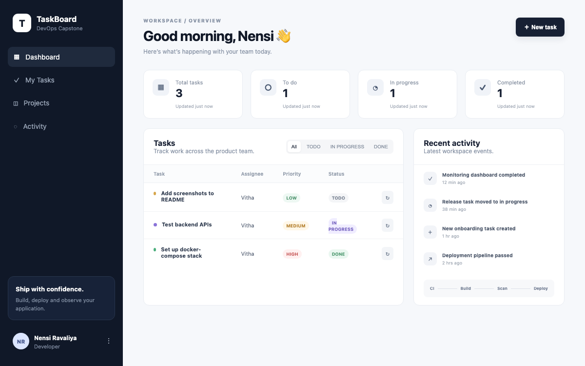

# Session 21 — Docker Compose

TaskBoard app: React frontend, FastAPI backend, Postgres database.

## Run it

```bash
docker compose up -d --build
```

```
$ docker compose ps
NAME                                   IMAGE                                SERVICE    STATUS
session-21-docker-compose-backend-1    session-21-docker-compose-backend    backend    Up
session-21-docker-compose-frontend-1   session-21-docker-compose-frontend   frontend   Up
session-21-docker-compose-postgres-1   postgres:16-alpine                   postgres   Up
```

Frontend on `localhost:3000`, backend on `localhost:8000`, Postgres on `localhost:5432`.

## Frontend



## Backend API

Full endpoint list: [`screenshots/backend_api_docs.png`](screenshots/backend_api_docs.png)

```
$ curl localhost:8000/health
{"status":"UP"}

$ curl localhost:8000/ready
{"status":"READY"}

$ curl -X POST localhost:8000/api/tasks -H "Content-Type: application/json" \
  -d '{"title":"Write session 21 README","priority":"HIGH","assignee":"Vitha"}'
{"title":"Write session 21 README","description":"","priority":"HIGH","status":"TODO","assignee":"Vitha","id":1,"created_at":"2026-10-07T16:39:15.808260Z"}

$ curl localhost:8000/api/tasks
[{"title":"Write session 21 README",...,"id":1,...}]

$ curl -X PUT localhost:8000/api/tasks/1 -H "Content-Type: application/json" -d '{"status":"IN_PROGRESS"}'
{"title":"Write session 21 README",...,"status":"IN_PROGRESS",...}

$ curl localhost:8000/api/tasks/stats
{"total":1,"todo":0,"inProgress":1,"done":0}

$ curl -X DELETE localhost:8000/api/tasks/1 -w '%{http_code}'
HTTP 204

$ curl localhost:8000/api/tasks
[]
```

Full output: [`api_test_output/crud_tests.txt`](api_test_output/crud_tests.txt)

Also checked the frontend's nginx reverse proxy forwards to the backend correctly:

```
$ curl localhost:3000/api/tasks
[...same tasks as localhost:8000/api/tasks...]

$ curl localhost:3000/health
{"status":"UP"}
```

Full output: [`api_test_output/backend_tests.txt`](api_test_output/backend_tests.txt)
